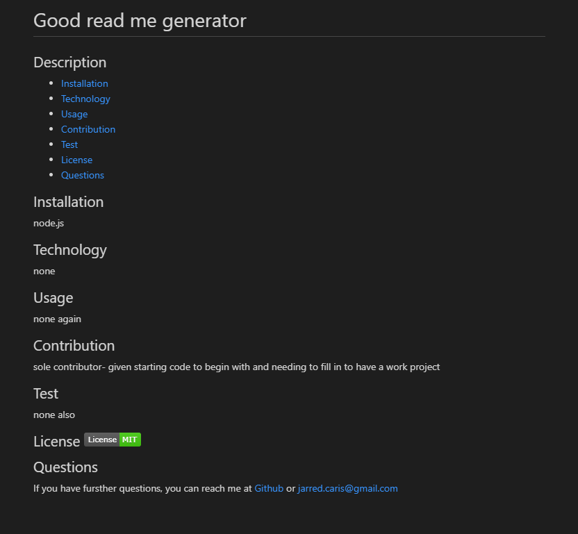

# Good Read Me Generator

# Create a read me markdown through a back end page

## Read Me Generator

This weeks homework was to create a working and functional markdown generator that will create a README.md file with pre filled information and structure

## This is the end result

## Where to access code

Git hub page. Screen shot of created read me available in assets folder

## My contribution

For this project, we were given some starting code. We had to build a large amount of the project from scartch to get the project to function as desired.

This envolved working back and forth between the generate markdown and index.js files to ensure they were communicating correctly.

We also needed to ensure the license badge for the selected license partner would display and also link to our github and email address for further questions

**explaining my page**

Suprisingly, this project was much simplier than I expected. Getting the array and read me set up was a breeze. The functions took a little longer but with previous in class activities and study sessions with other students, I had the bulk of it done in several hours. there was just some fine tuning i needed to add to make it all work correctly.

I can see the importance of working in this manner, in time im hoping to have a bettrer understanding but it acheived what i wanted and learnt alot in the process!
 
[click for page link] (https://jarred-caris.github.io/read_me_generator/.)